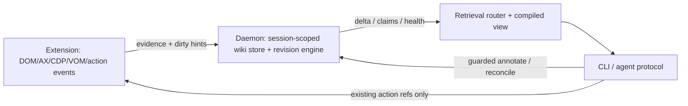

# Stage 4 architecture: Stateful Semantic Perception + Browser Wiki

Status: architecture proposal for focused review. This document defines the
contracts and decomposition for Stage 4; it does not authorize a broad runtime
refactor.

## 1. Scope and non-goals

Stage 4 adds a durable, local, revisioned semantic layer over the existing
BrowserSkill observation and interaction system. It lets an agent retrieve
task-relevant state without requiring a full `observe` on every turn, while
keeping browser facts evidence-backed and bounded.

The existing Stage 1-3 behavior remains the compatibility baseline:

- stable refs and the existing session-scoped ref store remain authoritative for
  actions;
- the interaction layer remains the sole resolver for action targets;
- popup opener/action lineage, session ownership, leases, sandbox policy,
  borrow/human-help/OTP/CAPTCHA/payment boundaries, and timeout-preserve-state
  behavior are unchanged;
- `main` remains the Tencent upstream mirror. Stage 4 work lands on the
  candidate branch and is reviewed before integration into `bsk-fix`;
- page content is stored locally by default. No page content or embeddings are
  sent to an external semantic/vector service without an explicit privacy
  design and user approval.

Non-goals are autonomous authorization expansion, a second action identity
system, per-DOM-node embeddings, unrestricted agent editing, and replacing the
existing full observation path before the incremental path is proven.

## 2. Design principles

1. **Evidence first.** DOM, accessibility, CDP/VOM observations, navigation
   events, and action results are append-oriented evidence. Semantic state is a
   derived, reviewable view of that evidence.
2. **Two trust planes.** Browser ground truth and agent inference are stored in
   separate namespaces and cannot be silently promoted across the boundary.
3. **Identity reuse.** A Wiki ref points to the existing stable ref,
   interaction-layer identity, popup lineage, and session ownership records; it
   does not mint an alternate clickable identity.
4. **Bounded freshness.** Every read reports revision, completeness, scope, and
   uncertainty. An incomplete delta is never presented as a complete snapshot.
5. **Cheap retrieval first.** Direct ref, region/tree, and delta reads precede
   lexical/semantic search; full observe remains the explicit fallback.
6. **Fail closed.** Ambiguous identity, mutation overflow, navigation boundary,
   ownership loss, or persistence failure removes confidence and may require a
   full refresh; it never authorizes an unsafe action.

## 3. Logical architecture



The extension remains the closest observer of page mutations and browser
identity. The daemon owns persistence, revision assignment, retrieval routing,
and session/ownership checks. The CLI is the agent-facing transport and does
not become a second browser observer. A local-only semantic index is optional;
it is an optimization behind the same evidence and privacy contract.

## 4. Canonical data model

All records carry `schema_version`, `created_at`, `updated_at`, and a
`scope` containing `{browser_id, session_id, tab_id, document_id, origin}`.
`document_id` is the existing document identity where available, not a URL
string. `browser_id`, session ownership, and tab ownership are checked before
every read or write.

### 4.1 PageInstance

```text
PageInstance {
  page_instance_id: opaque UUID
  scope: BrowserScope
  url: redacted-or-local URL metadata
  title: observed string | null
  document_id: existing document identity
  navigation_epoch: monotonic integer
  revision: uint64
  completeness: complete | partial | stale | unknown
  active: boolean
  invalidated_at: timestamp | null
}
```

A new document identity or navigation epoch creates a new PageInstance. A
same-document mutation increments the revision. Origin changes, tab reuse with
uncertain identity, session stop, browser disconnect, or ownership loss
invalidate the instance and all claims scoped to it.

### 4.2 Region

```text
Region {
  region_id: opaque UUID
  page_instance_id: PageInstance
  parent_region_id: Region | null
  kind: landmark | form | list | list_item | dialog | table | content | custom
  locator: existing stable ref / semantic graph identity | null
  bounds: existing geometry evidence | null
  revision_first_seen: uint64
  revision_last_seen: uint64
  state: active | removed | uncertain
  completeness: complete | partial | virtualized | unknown
}
```

Regions are semantic units for dirty tracking and optional indexing. They are
not action targets unless their `locator` resolves through the existing
interaction layer.

### 4.3 Ref

```text
Ref {
  ref_id: existing session-scoped stable ref
  page_instance_id: PageInstance
  region_id: Region | null
  interaction_kind: existing classification
  lifecycle: live | stale | invalidated
  last_observed_revision: uint64
}
```

The Wiki records and indexes refs; it never creates a parallel ref namespace.
An action must still go through the existing resolver and stale-ref self-heal.

### 4.4 Event

```text
Event {
  event_id: monotonic/opaque ID
  page_instance_id: PageInstance
  revision: uint64
  kind: observation | mutation | navigation | action | popup | ownership | error
  source: dom | ax | cdp | vom | daemon | cli | agent
  payload: bounded local evidence
  predecessor_event_id: Event | null
  completeness: complete | partial | overflow | unknown
}
```

Events are append-only evidence. Payloads are bounded and may be redacted by
the existing privacy policy. An event is not a claim merely because an agent
received it.

### 4.5 Claim

```text
Claim {
  claim_id: opaque UUID
  subject: PageInstance | Region | Ref | relation endpoint
  predicate: controlled semantic predicate
  value: typed JSON value
  trust: ground_truth | derived | agent_inference
  status: current | stale | superseded | uncertain | invalidated
  evidence_event_ids: one or more Event IDs
  evidence_revision: uint64
  last_verified_revision: uint64 | null
  confidence: 0..1 | null
  provenance: observed | reconciled | annotated
  author: extension | daemon | agent
  valid_from: revision/timestamp
  valid_until: revision/timestamp | null
}
```

Ground-truth claims can only be emitted by an observation/action adapter. A
derived claim is deterministic output from evidence. Agent inference is always
non-ground-truth and must carry evidence references plus uncertainty. A claim
whose evidence is invalidated becomes stale or invalidated according to the
reconciliation result; it is never silently deleted.

### 4.6 Relation

```text
Relation {
  relation_id: opaque UUID
  type: contains | labels | controls | opens | caused | references | item_of
        | owned_by | blocks | linked_to
  from_id: canonical record ID
  to_id: canonical record ID
  evidence_event_ids: Event IDs
  status: current | stale | superseded | uncertain | invalidated
  scope: same PageInstance unless explicitly cross-scope and authorized
}
```

Cross-page or cross-session relations require explicit provenance and are not
used for action authorization. Popup `opens` relations reuse recorded opener
lineage; they do not infer ownership from visual similarity.

## 5. Revisions, dirty regions, and deltas

The daemon assigns a monotonic revision per PageInstance. The extension sends
coalesced dirty hints with the existing document identity and a bounded reason
(`text`, `attributes`, `structure`, `visibility`, `scroll`, `navigation`, or
`action`). A dirty hint is advisory; the extension/daemon revalidates identity
before updating semantic state.

For a refresh from revision `r` to `r+n`, the engine emits:

```text
SemanticDelta {
  page_instance_id, from_revision, to_revision,
  added: [Region | Ref | Claim | Relation],
  changed: [{before, after, evidence}],
  removed: [canonical IDs],
  dirty_regions: [region IDs],
  completeness: complete | partial | overflow | ambiguous | full_refresh_required,
  fallback_reason: string | null
}
```

The engine uses region-level hashes and existing semantic-graph identities to
avoid treating harmless geometry churn as semantic change. Mutation storms,
queue overflow, unknown document identity, conflicting stable-ref mappings,
virtualized-list dedup failure, or a failed durable write produce
`full_refresh_required`. Until a successful full refresh, retrieval returns the
last known state with an explicit incomplete marker and action resolution keeps
its existing reobserve/self-heal behavior.

### Virtualized and infinite lists

Each list Region owns a persistent discovery frontier:

```text
ListFrontier { region_id, container_identity, observed_item_keys,
               scroll_windows, next_probe, exhausted: bool | unknown,
               last_complete_revision }
```

Item keys are derived from stable semantic identity or bounded content/position
evidence, never from position alone. Scroll discovery is resumable and
cross-window deduplicated. `exhausted=unknown` is the default for lazy lists;
the compiled view must say that the list is incomplete.

## 6. Retrieval router and compiled view

The router accepts a query intent and returns a typed envelope:

```text
RetrievalEnvelope {
  source: direct_ref | region_tree | delta | lexical | semantic | full_observe,
  page_instance_id, revision, scope, completeness,
  results, evidence, blockers, next_safe_query
}
```

Selection order and intended use:

1. `direct_ref`: resolve a known ref or relation, with normal action freshness
   checks.
2. `region_tree`: traverse active regions and their current claims.
3. `delta`: retrieve changes since an agent-provided revision/cursor.
4. `lexical`: search locally indexed stable labels, text claims, and region
   summaries.
5. `semantic`: search optional local embeddings of stable regions/chunks only.
6. `full_observe`: obtain a fresh existing observation when confidence,
   completeness, or identity is insufficient.

Semantic indexing is never performed per DOM node. It is opt-in, local by
default, bounded by region/chunk revision, and invalidated with its source
revision. The compiled consumption view is a deterministic projection with:

- current task-relevant claims and active interactive regions;
- recent deltas and their evidence revisions;
- dynamic/incomplete regions and virtual-list frontier state;
- session, ownership, popup lineage, blockers, and uncertainty;
- safe next retrieval/action prerequisites.

It must not include an action authorization that the underlying session and
interaction layer would reject.

## 7. Guarded Wiki maintenance

The agent-facing write contract has three operations:

- `annotate`: add an agent inference or explanation, linked to evidence; it can
  never create ground truth;
- `patch`: propose a change to a derived claim, requiring the expected evidence
  revision and a bounded patch set; conflicts return `stale_revision`;
- `reconcile`: ask the runtime to re-read evidence and accept, reject, or mark
  the proposal uncertain. Only the observation/action adapter can produce a
  ground-truth replacement.

Every write is scoped to the caller's session and current PageInstance. Writes
that cross origin, tab, document, session, or ownership boundaries fail closed.
Working memory is not an accepted evidence source. The runtime stores its
provenance if an agent submits it, but labels it `agent_inference`.

Health calculations are local and revision-aware:

- semantic orphan rate: active regions/claims with no valid incoming evidence
  or parent relation;
- relation/link coverage: expected relation classes with valid endpoints and
  evidence;
- stale-claim rate: stale/superseded/uncertain claims divided by active claims;
- delta completeness and full-refresh rate;
- virtual-frontier resumability and duplicate-item rate.

Metrics are diagnostics, not permission to auto-edit facts. A health report
includes sample IDs and the evidence revision used for computation.

## 8. Lifecycle and invalidation

```text
connect/session start
  -> establish PageInstance and ownership scope
  -> observe baseline (existing observe path)
  -> persist evidence + revision 0
  -> derive regions/claims/frontier
  -> receive mutation/action/navigation events
  -> coalesce dirty regions and emit bounded delta
  -> route retrieval / compile view
  -> reconcile guarded agent patches
```

Hard invalidation boundaries are navigation to a new document, origin change,
tab/document identity mismatch, session stop, browser disconnect, ownership
release, and detected persistence corruption. Same-document revisions may keep
the PageInstance but stale affected regions/claims. Session restart may restore
local records for inspection, but it must not restore action authorization or
live refs without a fresh observation and normal lease/ownership checks.

## 9. Compatibility and migration plan

Migration is additive and feature-flagged:

1. **Read-only shadow mode:** capture evidence/revisions beside existing
   `observe`; compare identities, region counts, and action target resolution.
2. **Local persistence mode:** enable the daemon store and restart recovery for
   Wiki reads, while all actions continue to use existing refs and resolvers.
3. **Delta mode:** enable dirty tracking for selected page types and lists;
   automatically fall back to full observe on any incomplete condition.
4. **Router mode:** expose direct/tree/delta retrieval, then local lexical and
   semantic retrieval behind independent flags.
5. **Guarded maintenance:** enable annotate first, then patch/reconcile after
   conflict and authorization tests pass.
6. **Default compiled view:** only after Stage 1-3 regression, real browser
   profile/login validation, privacy review, and the Stage 4 gates pass.

Old clients continue to receive existing observe/tool responses. New protocol
methods are capability-negotiated; an older extension returns an explicit
`unsupported` result and the daemon uses the old observe path. Persisted Wiki
records are versioned and migratable; an unknown schema is read as unavailable,
not guessed into ground truth.

## 10. CLI, daemon, and extension contracts

### CLI / protocol additions

Add capability-negotiated methods, with JSON output preserving scope and
completeness:

```text
wiki status [--session ID] [--tab-id N]
wiki observe --refresh | wiki delta [--since REV]
wiki get --ref REF | --region REGION
wiki search --text QUERY [--semantic]
wiki view [--task QUERY]
wiki annotate --evidence EVENT ...
wiki patch --expected-revision REV ...
wiki reconcile --proposal ID
wiki health
```

Names are illustrative until protocol review. Existing commands remain
unchanged; no Wiki command may bypass session/lease/interaction checks.

### Daemon

The daemon adds a per-session, per-PageInstance store, revision allocator,
bounded event queue, dirty-region coalescer, retrieval router, local index, and
health calculator. Storage limits, retention, redaction, and crash recovery are
explicit configuration. A full-refresh marker survives restart so a crash
cannot make partial state appear current.

### Extension

The extension adds a bounded mutation/evidence adapter and semantic-region
projection using existing VOM/document identity facilities. It reports action,
navigation, popup, and ownership events through the existing transport. It does
not persist data to a remote service, decide agent authorization, or resolve
actions outside the existing dispatcher.

## 11. Failure semantics

| Condition | Returned state | Required behavior |
| --- | --- | --- |
| old extension | `unsupported` | use existing observe |
| mutation overflow/storm | `full_refresh_required` | do not claim delta completeness |
| ambiguous identity | `ambiguous` | invalidate affected refs/claims; reobserve |
| stale patch revision | `stale_revision` | reload delta; never last-write-wins |
| ownership/session mismatch | `forbidden` | no read/write/action across boundary |
| persistence unavailable | `degraded` | bounded in-memory evidence; no durable-current claim |
| navigation/origin change | `invalidated` | create new PageInstance |
| vector/index unavailable | `unavailable` | use lexical/tree/full-observe path |
| action target stale | existing self-heal result | preserve existing resolver semantics |

Errors are machine-readable and include the last safe revision, scope, and a
recommended next query where safe. No error path silently broadens scope.

## 12. Test and evaluation plan

### Unit and protocol tests

- schema validation, scope checks, claim status transitions, evidence links,
  revision monotonicity, idempotent event ingestion, and migration fixtures;
- navigation/origin/document/session invalidation and stale-patch conflicts;
- capability negotiation with a Stage 3 extension and an unknown Wiki method;
- overflow, duplicate event, persistence failure, and crash-recovery cases;
- permission tests proving Wiki reads/writes cannot bypass action sandbox rules.

### Extension/daemon integration tests

- same-document text/attribute/structure changes produce correct add/change/
  remove deltas;
- mutation storms and uncertain refs force full refresh;
- virtualized/infinite lists resume across scroll windows without duplicate
  items and expose unknown exhaustion;
- popup opener/action lineage and session ownership remain intact;
- stale-ref action self-heal still succeeds or fails with the existing result;
- compiled view is bounded and includes blockers/incompleteness.

### Evaluation gates

For representative static, dynamic, dialog, popup, navigation, and virtualized
fixtures, record:

- retrieval latency/token size versus full observe;
- precision/recall of semantic additions, changes, removals, and refs;
- full-refresh and false-completeness rates;
- stale-claim, orphan, relation-coverage, and duplicate-frontier metrics;
- action success and unauthorized-action rejection compared with the Stage 3
  baseline;
- local retention/redaction behavior and absence of external content egress.

Real Windows browser/profile/login validation remains a release gate, including
CLI/daemon/extension build provenance and the final `bsk-fix` SHA.

## 13. Focused issue decomposition

Work remains serial at the integration boundary; each slice must preserve the
previous slice's tests and be reviewed before promotion.

| Stage | Deliverable | Exit criteria |
| --- | --- | --- |
| 4.1 | schema, scope, evidence/revision store design + fixtures | schema review; invalidation tests |
| 4.2 | extension evidence adapter and daemon shadow mode | Stage 3 behavior unchanged; parity report |
| 4.3 | dirty regions, delta engine, overflow fallback | dynamic/overflow/list tests pass |
| 4.4 | persistent virtualized-list frontier | resumability and dedup metrics pass |
| 4.5 | retrieval router and compiled view | direct/tree/delta/full-observe paths and bounds |
| 4.6 | local lexical index; optional local semantic chunks | privacy review; no per-node embeddings |
| 4.7 | guarded annotate/patch/reconcile + claim lifecycle | evidence-backed writes and conflict tests |
| 4.8 | health metrics and regression/eval harness | orphan/link/stale metrics reproducible |
| 4.9 | CLI/daemon/extension contract integration | capability fallback and real-browser gate |
| 4.10 | staged default rollout and final audit | all Stage 4 gates, branch hygiene, provenance |

No slice should begin broad refactoring until this architecture and its
corresponding issue acceptance criteria are narrowly reviewed.

## 14. Review decisions required

The focused review should decide the canonical record field names and retention
limits, the exact capability/version negotiation shape, whether local semantic
indexing is enabled in the first release, redaction defaults, and the initial
page/list fixture set. It should also confirm that every new action-facing path
still terminates in the existing interaction resolver and ownership checks.
